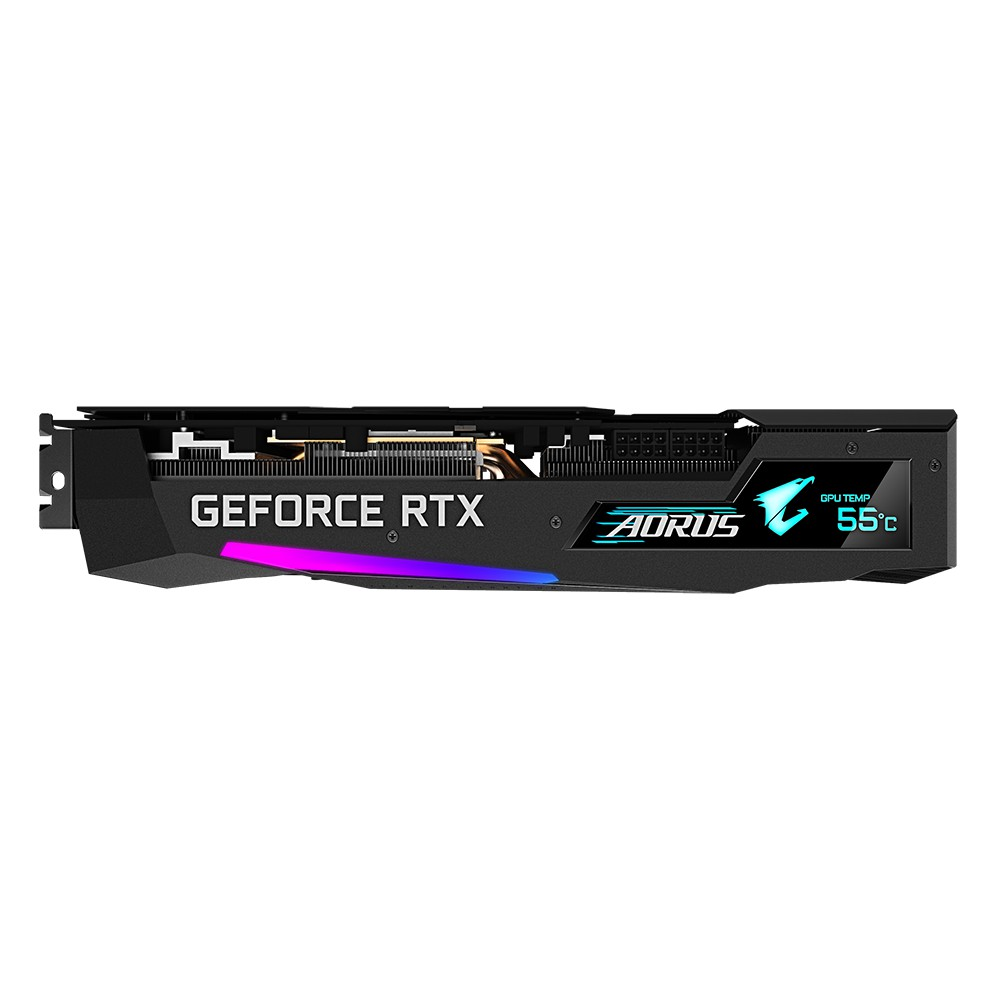
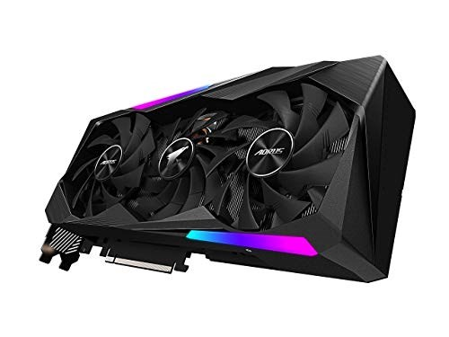
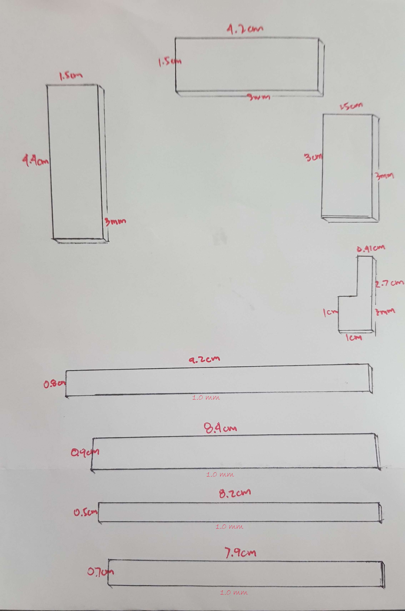

# Thermal Pad sizes for AORUS GeForce RTX™ 3070 MASTER 8G  

## The model of the GPU  
   
   
   
  
## Original Thermal Pads
   

## Thermal Pads leaking oils
  
  

## Thermal pads sizes, thickness and location
  
  

## Youtube Tutorial for replacing this specific GPU  
Youtube link... coming soon..  
